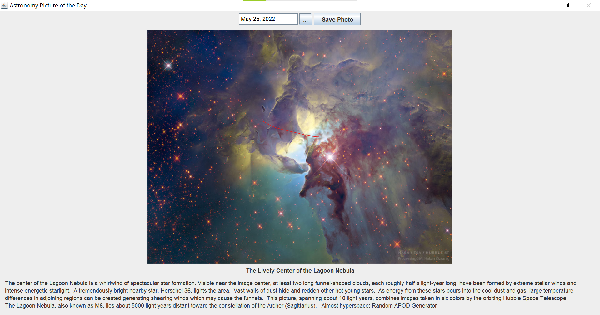
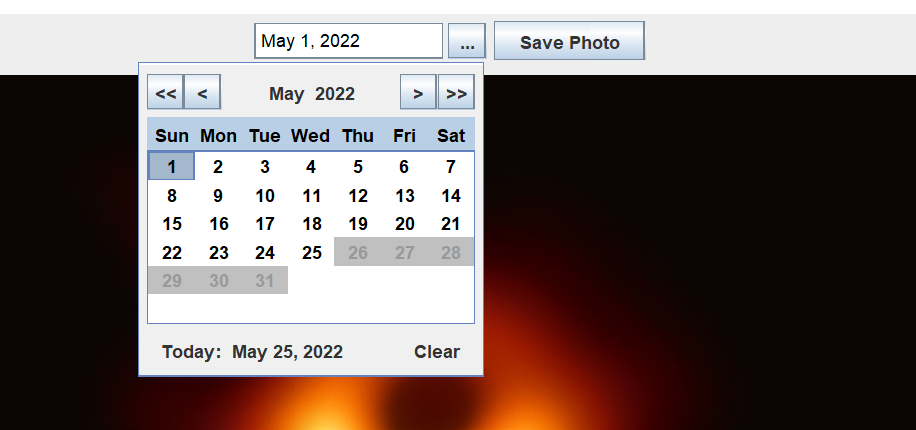
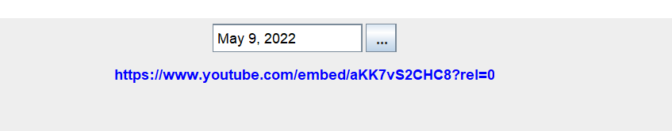
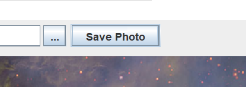

# Astronomy picture of the day (NASA)

Displays photo or video from the [nasa apod api](https://api.nasa.gov/) based on chosen date

This project uses:
- [Retrofit](https://github.com/square/retrofit)
- Gson
- Junit
- Mockito
- Rx
- Gradle
- [LGoodDatePicker](https://github.com/LGoodDatePicker/LGoodDatePicker)
- Apache Commons IO
 
Default Display with today's date

Date Picker - calender includes dates from June 16, 1995 through today's date

Hyperlink provided for dates where a video is returned 

Button to download currently displayed photo

